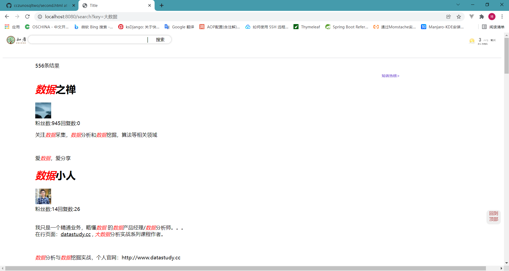
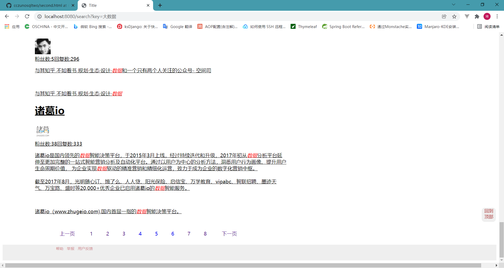
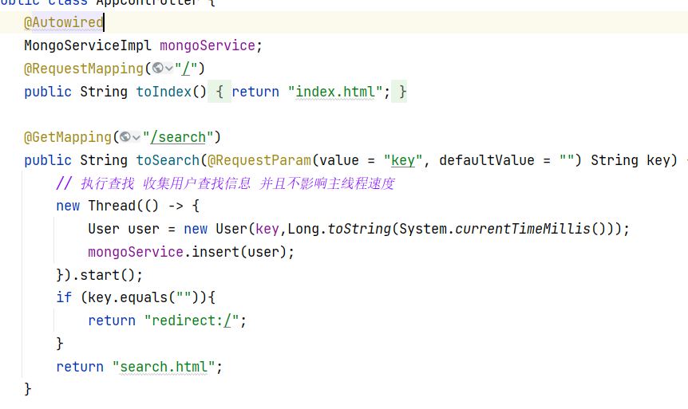

# V1.2

已初步搭好了搜索功能，后续将分词等功能加上
搜索的接口是/s
输出查找框的名称使用key
点击后就会返回与之相关的json对象组

# v1.2

新版接口 /search/{key}/{page}

# v1.3

重写整写前后端，向输入框输入数据，会根据输入框进行判断，若输入框为空则重定向会search页面，

根据输入的关键字，es进行搜索，根据匹配得分进行排序，高亮关键字，输出到前端

新增了收集数据，方便了解用户喜好，给用户推荐更好的服务

